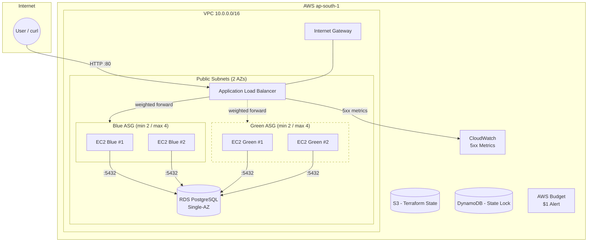
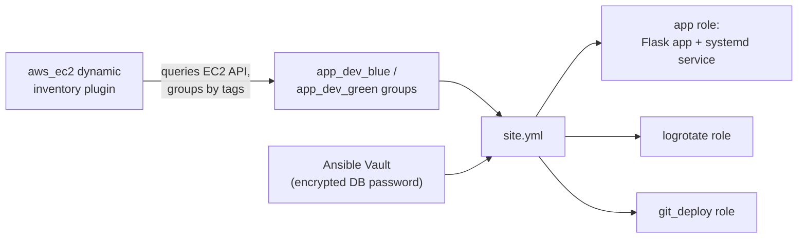
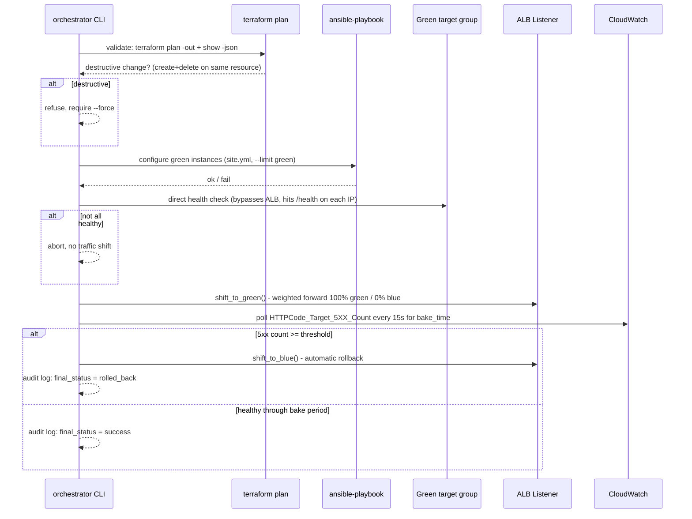
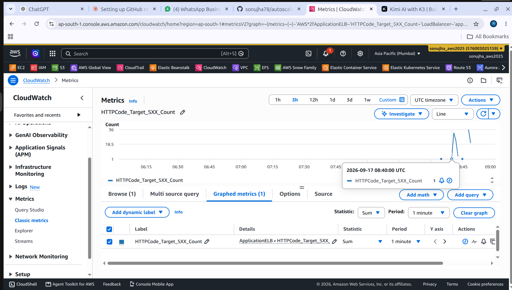

# Auto-Scaling Web Platform — Terraform + Ansible + Python Orchestrator

Production-style 3-tier AWS platform, built free-tier-safe: **Terraform** provisions infrastructure, **Ansible** configures the application layer, and a **Python CLI orchestrator** ties them together to perform blue-green deployments with automatic health checking and rollback.

Repo: https://github.com/sonujha78/autoscaling-web-platform

---

## Table of Contents

1. [Architecture](#architecture)
2. [Repository Structure](#repository-structure)
3. [Prerequisites](#prerequisites)
4. [Part 1 — Terraform Infrastructure](#part-1--terraform-infrastructure)
5. [Part 2 — Ansible Configuration](#part-2--ansible-configuration)
6. [Part 3 — Python Deployment Orchestrator](#part-3--python-deployment-orchestrator)
7. [Part 4 — Failure Test (Auto-Rollback Proof)](#part-4--failure-test-auto-rollback-proof)
8. [Part 5 — Testing](#part-5--testing)
9. [Part 6 — Cost Control](#part-6--cost-control)
10. [Part 7 — Dev/Prod Environment Proof](#part-7--devprod-environment-proof)
11. [Evidence & Artifacts](#evidence--artifacts)

---

## Architecture

### Infrastructure (Terraform-managed)



- **Networking module**: VPC, 2 public subnets (no NAT Gateway — free-tier trade-off), IGW, route table, 3 security groups (ALB / app / db, each scoped to only what needs to talk to it).
- **Loadbalancer module**: ALB with a single HTTP listener using **weighted target-group forwarding** between a `blue` and a `green` target group — this weighting is exactly what the Python orchestrator manipulates via `boto3` during a deploy.
- **Compute module**: parameterized by a `slot` variable (`blue` / `green`) so it can be instantiated twice from the same code — Launch Template + Auto Scaling Group + CPU-based scaling policy, each slot tagged `AnsibleGroup = app_<env>_<slot>` so Ansible's dynamic inventory can target them separately.
- **Database module**: RDS PostgreSQL, Single-AZ (free-tier trade-off, see [Part 6](#part-6--cost-control)), network-isolated to only the app security group.
- **Remote state**: S3 bucket + DynamoDB lock table, provisioned once via a separate `terraform/bootstrap` config (chicken-and-egg problem — the backend can't be defined by the same state it stores).

### Ansible configuration flow



No static inventory, no pasted IPs — instances launched by either ASG are discovered automatically via their `Environment` and `AnsibleGroup` tags.

### Python orchestrator — blue-green decision flow



---

## Repository Structure

```
autoscaling-web-platform/
├── terraform/
│   ├── bootstrap/              # one-time: S3 state bucket + DynamoDB lock table
│   ├── modules/
│   │   ├── networking/         # VPC, subnets, IGW, route table, security groups
│   │   ├── compute/             # Launch Template + ASG + scaling policy (slot-aware)
│   │   ├── database/            # RDS PostgreSQL Single-AZ
│   │   └── loadbalancer/        # ALB + blue/green target groups + weighted listener
│   └── environments/
│       ├── dev/                 # dev.tfvars, wires all modules (blue + green)
│       └── prod/                # prod.tfvars, same code, independent state key
├── ansible/
│   ├── inventory/aws_ec2.yml    # dynamic inventory (aws_ec2 plugin)
│   ├── roles/
│   │   ├── app/                 # Flask app + systemd service
│   │   ├── logrotate/           # log rotation config
│   │   └── git_deploy/          # git-based app code deployment
│   ├── group_vars/
│   │   ├── env_dev/             # main.yml (plaintext) + vault.yml (encrypted DB password)
│   │   └── env_prod/
│   ├── site.yml                 # master playbook
│   └── ansible.cfg
├── orchestrator/                 # Python CLI (click + boto3 + subprocess)
│   ├── orchestrator/
│   │   ├── cli.py                # click commands: validate / deploy / rollback
│   │   ├── config.py             # central config (env-var driven)
│   │   ├── terraform_check.py    # destructive-change detection
│   │   ├── health_check.py       # direct (ALB-bypass) health checks
│   │   ├── traffic_shift.py      # boto3 ALB weighted-forward manipulation
│   │   ├── rollback.py           # CloudWatch 5xx monitoring + rollback decision
│   │   ├── audit_log.py          # structured JSON audit log per run
│   │   └── deploy.py             # ties all of the above into one flow
│   ├── tests/                    # pytest — 21 tests, no AWS calls (pure logic + moto)
│   └── audit_logs/               # JSON logs from real deployment runs
├── docs/
│   ├── cost-tradeoffs.md         # NAT Gateway / RDS Multi-AZ write-up
│   ├── dev-plan-output.txt
│   ├── prod-plan-output.txt
│   ├── pytest-output.txt
│   └── evidence/
│       └── cloudwatch-5xx-spike-rollback.png
└── README.md                     # this file
```

---

## Prerequisites

- Ubuntu machine with `git`, `aws` CLI, `terraform`, `ansible`, `python3` installed
- AWS account with an IAM user (programmatic access) configured via `aws configure`
- An EC2 key pair for SSH access to instances

```bash
aws sts get-caller-identity   # verify credentials
```

---

## Part 1 — Terraform Infrastructure

### 1.1 Cost control first: AWS Budget alert

Before touching any infrastructure, a $1/month budget alert was created via the CLI so any unexpected spend triggers an email immediately:

```bash
aws budgets create-budget \
  --account-id <ACCOUNT_ID> \
  --budget file://budget.json \
  --notifications-with-subscribers file://notifications.json
```

`budget.json` — `BudgetLimit: {"Amount": "1", "Unit": "USD"}`, `TimeUnit: MONTHLY`.
`notifications.json` — email alert at 80% of threshold.

### 1.2 Remote state bootstrap

A one-time, locally-stated Terraform config (`terraform/bootstrap/`) created:
- S3 bucket (versioned, encrypted, public access blocked) — `autoscaling-platform-tfstate-<account-id>`
- DynamoDB table (`PAY_PER_REQUEST`) for state locking — `autoscaling-platform-tf-lock`

```bash
cd terraform/bootstrap
terraform init && terraform apply
```

**Result:**
```
Apply complete! Resources: 5 added, 0 changed, 0 destroyed.
Outputs:
lock_table_name  = "autoscaling-platform-tf-lock"
state_bucket_name = "autoscaling-platform-tfstate-576003025159"
```

### 1.3 Networking, Compute, Database, Loadbalancer modules

Each module is self-contained under `terraform/modules/`. The **compute** module takes a `slot` variable so it can be called twice (`compute_blue`, `compute_green`) from the same environment config — each produces its own Launch Template, ASG, and scaling policy, named distinctly (`autoscaling-platform-dev-blue-asg` / `-green-asg`) and tagged so Ansible can target each slot independently.

### 1.4 Wiring it together — `environments/dev/main.tf`

```hcl
module "networking"    { source = "../../modules/networking" ... }
module "loadbalancer"  { source = "../../modules/loadbalancer" ... }
module "compute_blue"  { source = "../../modules/compute"; slot = "blue"; target_group_arns = [module.loadbalancer.blue_target_group_arn] ... }
module "compute_green" { source = "../../modules/compute"; slot = "green"; target_group_arns = [module.loadbalancer.green_target_group_arn] ... }
module "database"      { source = "../../modules/database" ... }
```

Remote backend, keyed per environment:

```hcl
backend "s3" {
  bucket         = "autoscaling-platform-tfstate-576003025159"
  key            = "dev/terraform.tfstate"
  region         = "ap-south-1"
  dynamodb_table = "autoscaling-platform-tf-lock"
  encrypt        = true
}
```

### 1.5 Init, plan, apply

```bash
cd terraform/environments/dev
terraform init
terraform plan -var-file=dev.tfvars
terraform apply -var-file=dev.tfvars
```

**Result (final, after resolving a target-group-name-length limit and a t2.micro capacity constraint — see [Troubleshooting](#troubleshooting-notes) below):**

```
Apply complete! Resources: 6 added, 0 changed, 3 destroyed.
Outputs:
alb_dns_name    = "autoscaling-platform-dev-alb-1037367969.ap-south-1.elb.amazonaws.com"
blue_asg_name   = "autoscaling-platform-dev-blue-asg"
green_asg_name  = "autoscaling-platform-dev-green-asg"
db_endpoint     = "autoscaling-platform-dev-db.cj42keq8c1tt.ap-south-1.rds.amazonaws.com:5432"
vpc_id          = "vpc-03eedb56e652f1a83"
```

Full plan output: [`docs/dev-plan-output.txt`](docs/dev-plan-output.txt)

### Troubleshooting notes (kept for transparency)

- **`aws_lb_target_group` name > 32 chars** — AWS hard limit; shortened `autoscaling-platform-${env}-tg-green` → `asp-${env}-tg-green`.
- **`InvalidParameterCombination: Cannot find version 16.4 for postgres`** — queried available versions with `aws rds describe-db-engine-versions` and used `16.15`.
- **`We currently do not have sufficient t2.micro capacity`** — switched instance type to `t3.micro` (also free-tier eligible) in both the module default and the environment-level override (a variable existed at both levels — a good reminder to check overrides, not just the module default).
- **ASG "AlreadyExists ... pending delete"** — a prior failed `apply` left an ASG mid-deletion; resolved by polling `describe-auto-scaling-groups` until the name freed up before retrying `apply`.
- **Health-check churn during first boot** — with `health_check_type = ELB` and no app deployed yet, the ASG continuously replaced "unhealthy" instances before Ansible could reach them. Fixed by temporarily setting `health_check_type = EC2` (or suspending the `ReplaceUnhealthy` process) while Ansible ran, then reverting to `ELB` once the `/health` endpoint was live.

---

## Part 2 — Ansible Configuration

### 2.1 Dynamic inventory

`ansible/inventory/aws_ec2.yml`:

```yaml
plugin: amazon.aws.aws_ec2
regions: [ap-south-1]
filters:
  tag:Environment: dev
  instance-state-name: running
keyed_groups:
  - key: tags.AnsibleGroup
    prefix: ""
    separator: ""
  - key: tags.Environment
    prefix: env
hostnames: [dns-name, private-ip-address]
compose:
  ansible_host: public_ip_address
```

```bash
ansible-inventory -i inventory/aws_ec2.yml --graph
```

**Result:** groups `app_dev_blue`, `app_dev_green`, `env_dev` populated automatically from EC2 tags — no static IPs anywhere.

### 2.2 Roles

- **`app`** — installs Python3/Flask, creates a dedicated `appuser`, deploys `app.py` (a small Flask app exposing `/health` and `/`) and a `systemd` unit, starts/enables the service.
- **`logrotate`** — configures `/etc/logrotate.d/app` (daily, 7-day retention, compressed).
- **`git_deploy`** — installs `git`, clones/pulls the app repo into `/opt/app-src` when `app_git_repo` is set (used by the orchestrator for real code deploys; a no-op placeholder in this demo).

### 2.3 Secrets — Ansible Vault

The DB password is never stored in plaintext:

```bash
ansible-vault encrypt_string 'ChangeThisStrongPassword123!' --name 'vault_db_password' >> group_vars/env_dev/vault.yml
```

`group_vars/env_dev/main.yml` references it:
```yaml
db_password: "{{ vault_db_password }}"
```

A vault password file (`~/.ansible-vault-pass`, outside the repo) is referenced from `ansible.cfg`:
```ini
[defaults]
vault_password_file = ~/.ansible-vault-pass
```

### 2.4 Running the playbook

```bash
ansible-playbook site.yml \
  --private-key ~/.ssh/autoscaling-platform-dev-key.pem \
  --user ec2-user \
  --limit app_dev_blue
```

**Result:**
```
PLAY RECAP
ec2-...-207-184-127 : ok=13  changed=12  unreachable=0  failed=0  skipped=1
ec2-...-3-111-41-142 : ok=13  changed=12  unreachable=0  failed=0  skipped=1
```

Verified end-to-end through the ALB:
```bash
curl http://autoscaling-platform-dev-alb-1037367969.ap-south-1.elb.amazonaws.com/health
# {"status":"ok"}
```

---

## Part 3 — Python Deployment Orchestrator

A `click` + `boto3` + `subprocess` CLI (`orchestrator/`) that ties Terraform and Ansible into one real deployment workflow.

### 3.1 Pre-deployment validation — `validate` command

Runs `terraform plan -out=plan.tfplan`, parses it via `terraform show -json`, and inspects each resource's `change.actions`. Any resource whose actions are exactly `["delete"]`, `["create","delete"]`, or `["delete","create"]` is flagged as **destructive** (this is precisely how an RDS replacement would show up) — the command then refuses to proceed unless `--force` is passed.

```bash
python -m orchestrator.cli validate
```

**Result:**
```
Resources to add: 0
Resources to change: 1
Resources to destroy: 0

No destructive changes detected. Safe to proceed.
```

### 3.2 Blue-green orchestration — `deploy` command

```bash
python -m orchestrator.cli deploy \
  --listener-arn "$LISTENER_ARN" \
  --blue-tg-arn "$BLUE_TG_ARN" \
  --green-tg-arn "$GREEN_TG_ARN" \
  --alb-arn-suffix "$ALB_SUFFIX" \
  --private-key ~/.ssh/autoscaling-platform-dev-key.pem
```

Stages (each recorded to the audit log):

1. **`ansible_configure`** — runs `site.yml --limit app_dev_green` against the green ASG via dynamic inventory.
2. **`green_health_check`** — bypasses the ALB entirely: resolves the green target group's current instances via `boto3`, hits `http://<instance-ip>:8080/health` directly on each with `requests` + retry logic. Refuses to proceed if any instance fails.
3. **`traffic_shift_to_green`** — `elbv2.modify_listener()` sets the weighted-forward action to green=100 / blue=0.
4. **`bake_monitor`** — polls CloudWatch `HTTPCode_Target_5XX_Count` every 15s for a configurable bake window (`BAKE_TIME_SECONDS`). If the cumulative count reaches `ROLLBACK_5XX_THRESHOLD`, triggers automatic rollback.
5. **`rollback_to_blue`** (only if triggered) — shifts weights back to blue=100 / green=0.

### 3.3 Deployment audit log

Every run writes a structured JSON log (`orchestrator/audit_logs/deploy-<run_id>.json`) with per-stage pass/fail, timestamps, and details — see [Evidence](#evidence--artifacts) for real examples of both a successful and a rolled-back run.

---

## Part 4 — Failure Test (Auto-Rollback Proof)

Per the task's "harder path" requirement: a deliberately broken app version was allowed to briefly go live, and the orchestrator's automatic rollback was proven with evidence.

### 4.1 Deploy a broken version to green

The `/` route was modified to return `500`, while `/health` still returned `200` (so the health-check stage — which only checks `/health` — would pass, and the bug would only surface once real traffic hit `/`):

```python
@app.route("/")
def index():
    return jsonify(error="internal server error"), 500
```

Deployed directly to the green instances and restarted the service.

### 4.2 Run the orchestrator against the broken green

```bash
export BAKE_TIME_SECONDS=240
python -m orchestrator.cli deploy \
  --listener-arn "$LISTENER_ARN" --blue-tg-arn "$BLUE_TG_ARN" --green-tg-arn "$GREEN_TG_ARN" \
  --alb-arn-suffix "$ALB_SUFFIX" --private-key ~/.ssh/autoscaling-platform-dev-key.pem \
  --skip-ansible
```

### 4.3 Generate real traffic against `/` during the bake window

In parallel, a loop hit `/` on the ALB once per second for the duration of the bake window:

```bash
for i in $(seq 1 280); do
  curl -s -o /dev/null -w "%{http_code} " "http://$ALB_DNS/"
  sleep 1
done
```

**Traffic pattern observed:** `200 (blue) → 500 × N (green, broken) → 200 (blue, post-rollback)`

### 4.4 Result: automatic rollback triggered

```
Deployment rolled back to blue due to elevated error rate.
```

Audit log (`orchestrator/audit_logs/deploy-20260917T084745.json`):

```json
{
  "final_status": "rolled_back",
  "stages": [
    { "stage": "green_health_check", "status": "pass" },
    { "stage": "traffic_shift_to_green", "status": "pass", "details": {"green_weight": 100, "blue_weight": 0} },
    { "stage": "bake_monitor", "status": "fail",
      "details": {"reason": "5xx error count (21) reached/exceeded threshold (5)", "total_5xx_count": 21} },
    { "stage": "rollback_to_blue", "status": "pass",
      "details": {"reason": "5xx error count (21) reached/exceeded threshold (5)"} }
  ]
}
```

CloudWatch confirms the same story visually — a sharp spike in `HTTPCode_Target_5XX_Count` during the test window, back to zero after rollback:



Recovery verified directly:
```bash
curl -s http://autoscaling-platform-dev-alb-1037367969.ap-south-1.elb.amazonaws.com/
# {"environment":"dev","hostname":"ip-10-0-1-117...","message":"Hello from ..."}
```

**Note on CloudWatch metric delay:** the first attempt at this test used a 2-minute bake window and CloudWatch's ALB metrics (which can lag 1–3 minutes before being queryable) hadn't yet reflected most of the 5xx errors by the time the bake period ended — the run reported only 1 error and "succeeded" even though ~59 real 500s had already been served. Extending the bake window to 4 minutes and generating traffic continuously through the whole window resolved this and is a good real-world lesson about CloudWatch's eventual consistency.

---

## Part 5 — Testing

Per-requirement: unit tests for the orchestrator's decision logic, with `moto`/`unittest.mock` so tests never touch real AWS.

```bash
cd orchestrator
python -m pytest tests/ -v
```

**Result:**
```
collected 21 items

tests/test_health_check.py ........................... 3 passed
tests/test_moto_integration.py ......................... 1 passed
tests/test_rollback.py ................................. 6 passed
tests/test_terraform_check.py .......................... 7 passed
tests/test_traffic_shift.py ............................ 4 passed

21 passed in 0.77s
```

Full output: [`docs/pytest-output.txt`](docs/pytest-output.txt)

Key tests:
- **`test_terraform_check.py`** — "is the plan destructive" logic in isolation (pure function, no terraform/AWS calls): covers pure create, pure update, pure delete, and both replace orderings (`create,delete` / `delete,create`).
- **`test_rollback.py`** — "should I rollback" logic in isolation: below/at/above threshold, default-threshold-from-config.
- **`test_moto_integration.py`** — a real `boto3` ELBv2 client, mocked end-to-end with `moto`, exercising `get_current_weights` / `shift_traffic` against a fake VPC/ALB/listener/target-groups — proves the boto3 integration logic works without ever touching AWS.

---

## Part 6 — Cost Control

- **AWS Budget** — $1/month alert configured via CLI before any infrastructure was created ([Part 1.1](#11-cost-control-first-aws-budget-alert)).
- **`terraform destroy` discipline** — infra torn down after test/demo sessions to avoid idle ALB/ASG/RDS charges.
- **Cost trade-off write-up** — full reasoning for why this build skips a NAT Gateway and RDS Multi-AZ (both real free-tier blockers) despite a real production deployment needing both: [`docs/cost-tradeoffs.md`](docs/cost-tradeoffs.md).

Summary table from that write-up:

| Component | This build | Real production | Why the difference |
|---|---|---|---|
| App subnets | Public, SG-restricted | Private, behind NAT | NAT Gateway is not free-tier eligible |
| RDS | Single-AZ | Multi-AZ | Multi-AZ ~2x instance cost, not free-tier eligible |

---

## Part 7 — Dev/Prod Environment Proof

Per the task requirement to "prove the same code deploys two independent environments," a `terraform/environments/prod` config was created from the **same modules**, differing only in `prod.tfvars` (different CIDR, different DB credentials) and its state key (`prod/terraform.tfstate` vs `dev/terraform.tfstate` — same S3 bucket, isolated by key).

```bash
cd terraform/environments/prod
terraform init
terraform plan -var-file=prod.tfvars
```

**Result (plan only — not applied, to avoid duplicate infrastructure cost):**
```
Plan: 22 to add, 0 to change, 0 to destroy.

Changes to Outputs:
  + alb_dns_name   = (known after apply)
  + blue_asg_name  = "autoscaling-platform-prod-blue-asg"
  + green_asg_name = "autoscaling-platform-prod-green-asg"
  + db_endpoint    = (known after apply)
  + vpc_id         = (known after apply)
```

Same modules, same code path, completely independent resource names (`-prod-` vs `-dev-`) and a different VPC CIDR (`10.1.0.0/16` vs `10.0.0.0/16`) — driven entirely by `prod.tfvars`. Full output: [`docs/prod-plan-output.txt`](docs/prod-plan-output.txt) (dev equivalent: [`docs/dev-plan-output.txt`](docs/dev-plan-output.txt)).

---

## Evidence & Artifacts

| Artifact | Location |
|---|---|
| Terraform plan — dev | `docs/dev-plan-output.txt` |
| Terraform plan — prod | `docs/prod-plan-output.txt` |
| pytest output (21 passing) | `docs/pytest-output.txt` |
| Cost trade-off write-up | `docs/cost-tradeoffs.md` |
| CloudWatch 5xx spike/recovery graph | `docs/evidence/cloudwatch-5xx-spike-rollback.png` |
| Successful deployment audit log | `orchestrator/audit_logs/deploy-20260917T083926.json` |
| Rolled-back deployment audit log | `orchestrator/audit_logs/deploy-20260917T084745.json` |

---

## Why This Is the Right "Terraform + Ansible + Python" Story

Most people who list Terraform, Ansible, and Python on a resume used each one on a separate, unrelated project. This build forces all three into one real deployment story: **Terraform** builds the infrastructure, **Ansible** configures it, and **Python is the glue** that makes the decisions neither tool handles natively — validating a plan before applying it, shifting live traffic between two environments, watching real error metrics, and rolling back automatically when they spike. That's a concrete, evidence-backed answer to "walk me through how you'd deploy a change to production."
